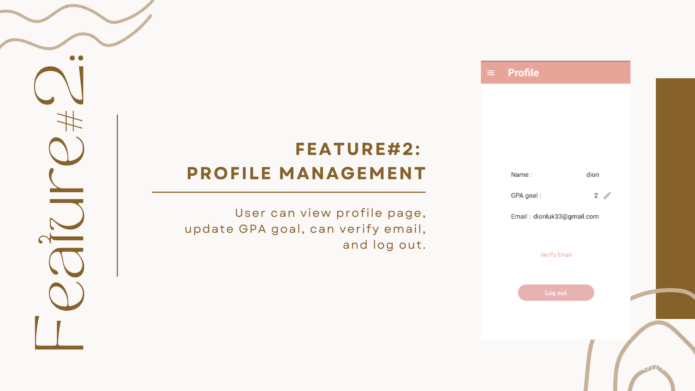

# 🧸 bearlance 🎈
This project is a senior project.

## 🔖 Getting Started... ✨

  From our app's name, Bearlance comes from the combination of the words bear and balance. Bear is the mascot of the app while the balance is from the sentence work-life balance which means the division of work time and good mental health by keeping these go together, studying more efficiently, and staying mentally healthy.

## UI application 📲

